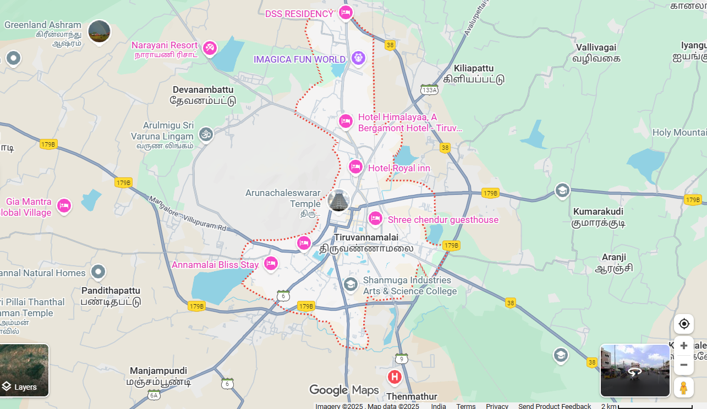
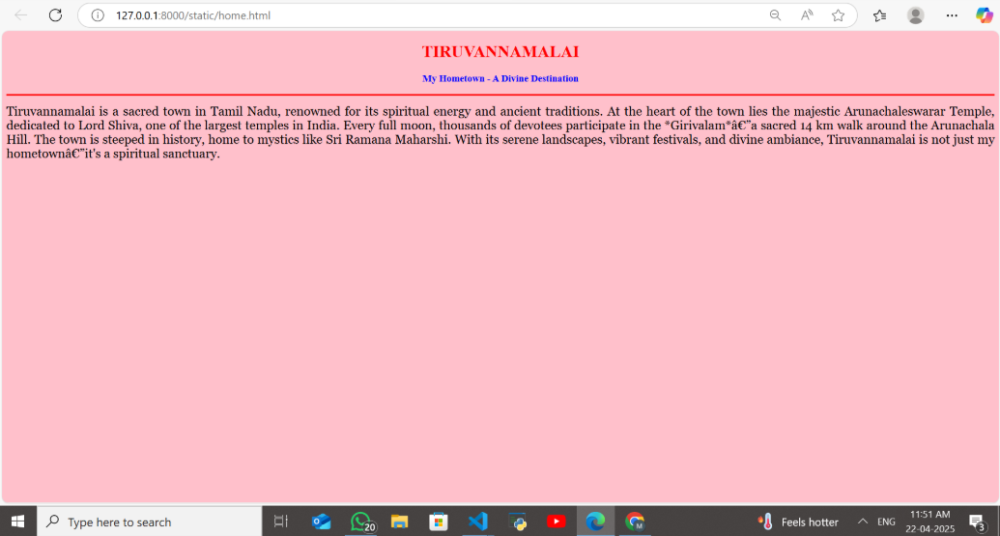
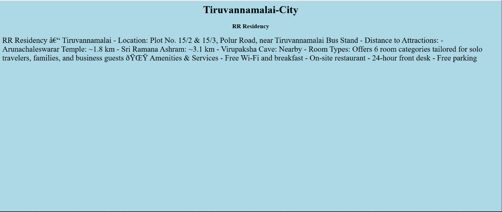
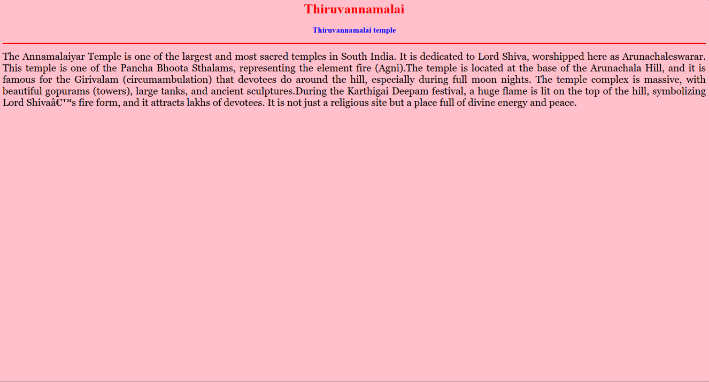
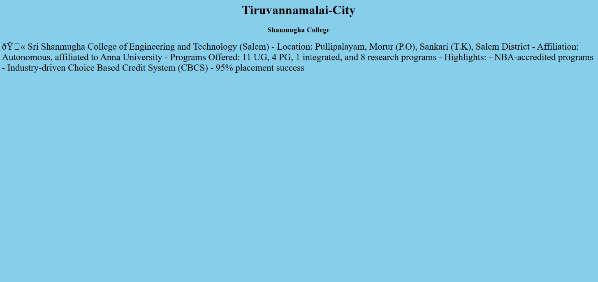

# Ex04 Places Around Me
## Date: 10-12-2025
###REF:25015705

## AIM
To develop a website to display details about the places around my house.

## DESIGN STEPS

### STEP 1
Create a Django admin interface.

### STEP 2
Download your city map from Google.

### STEP 3
Using ```<map>``` tag name the map.

### STEP 4
Create clickable regions in the image using ```<area>``` tag.

### STEP 5
Write HTML programs for all the regions identified.

### STEP 6
Execute the programs and publish them.

## CODE
~~~
map.html:
<html>
    <head>
        <title>
            map-Thiruvannamalai
        </title>
        <link rel="stylesheet" href="style.css">
    </head>
    <body bgcolor="pink">
        <h2 align="center">Thiruvannamalai - City</h2>
        <h3 align="center">RAGHUL.S (25015705)</h3>
    

<map name="image-map">
    <area target="" alt="Shanmuga college" title="Shanmuga college" href="college.html" coords="963,706,1201,740" shape="rect">
    <area target="" alt="Annamalaiyar temple" title="Annamalaiyar temple" href="hill.html" coords="803,366,874,365,878,424,807,424" shape="poly">
    <area target="" alt="HOMETOWN" title="HOMETOWN" href="home.html" coords="773,708,26" shape="circle">
    <area target="" alt="RR Residency" title="RR Residency" href="RR residency.html" coords="984,395,1032,387,1032,420,988,435" shape="poly">
    <area target="" alt="MURUGAN Temple Devotional Centre" title="MURUGAN Temple Devotional Centre" href="temple.html" coords="918,484,975,478,965,525,914,525" shape="poly">
</map>

</body>
</html>

home.html
<!DOCTYPE html>
<html>
<head>
    <title>HOMETOWN</title>
</head>
<body bgcolor="pink">
    <h1 align="center">
        <font color="red"><b>TIRUVANNAMALAI</b></font>
    </h1>
    <h3 align="center">
        <font color="blue"><b>My Hometown - A Divine Destination</b></font>
    </h3>
    <hr size="3" color="red">
    <p align="justify">
        <font face="Georgia" size="5">
            Tiruvannamalai is a sacred town in Tamil Nadu, renowned for its spiritual energy and ancient traditions.
            At the heart of the town lies the majestic Arunachaleswarar Temple, dedicated to Lord Shiva, one of the largest temples in India.
            Every full moon, thousands of devotees participate in the *Girivalam*—a sacred 14 km walk around the Arunachala Hill.
            The town is steeped in history, home to mystics like Sri Ramana Maharshi. With its serene landscapes, vibrant festivals, and divine ambiance,
            Tiruvannamalai is not just my hometown—it's a spiritual sanctuary.
        </font>
    </p>
</body>
</html> 

RR residency
   <html>
    <head>
        <title align="center">map-Thiruvannamalai</title>
    </head>
    <body bgcolor="lightblue">
        <h1 align="center">Thiruvannamalai-City</h1>
        <h3 align="center"> RR Residency </h3>
        <p>
            <font size="5">
                 RR Residency - Thiruvannamalai
- Location: Plot No. 15/2 & 15/3, Polur Road, near Tiruvannamalai Bus Stand
- Distance to Attractions:
- Arunachaleswarar Temple: ~1.8 km
- Sri Ramana Ashram: ~3.1 km
- Virupaksha Cave: Nearby
- Room Types: Offers 6 room categories tailored for solo travelers, families, and business guests

🌟 Amenities & Services
- Free Wi-Fi and breakfast
- On-site restaurant
- 24-hour front desk
- Free parking

            </font>
        </p>
    </body>
</html>

temple.html
<!DOCTYPE html>
<html>
<head>
    <title>TEMPLE</title>
</head>
<body bgcolor="pink">
    <h1 align="center">
        <font color="red"><b>TIRUVANNAMALAI</b></font>
    </h1>
    <h3 align="center">
        <font color="blue"><b>MURUGAN Temple Devotional Centre</b></font>
    </h3>
    <hr size="3" color="red">
    <p align="justify">
        <font face="Georgia" size="5">
           The Annamalaiyar Temple is one of the largest and most sacred temples in South India. It is dedicated to Lord Shiva, worshipped here as Arunachaleswarar. This temple is one of the Pancha Bhoota Sthalams, representing the element fire (Agni).The temple is located at the base of the Arunachala Hill, and it is famous for the Girivalam (circumambulation) that devotees do around the hill, especially during full moon nights. The temple complex is massive, with beautiful gopurams (towers), large tanks, and ancient sculptures.During the Karthigai Deepam festival, a huge flame is lit on the top of the hill, symbolizing Lord Shiva’s fire form, and it attracts lakhs of devotees. It is not just a religious site but a place full of divine energy and peace.
        </font>
    </p>
</body>
</html>

college.html
<html>
    <head>
        <title>map-Tiruvannamalai</title>
    </head>
    <body bgcolor="skyblue">
        <h1 align="center">Thiruvannamalai-City</h1>
        <h3 align="center">Shanmugha College</h3>
        <p>
            <font size="5">

                🏫 Sri Shanmugha College of Engineering and Technology (Salem)
- Location: Pullipalayam, Morur (P.O), Sankari (T.K), Salem District
- Affiliation: Autonomous, affiliated to Anna University
- Programs Offered: 11 UG, 4 PG, 1 integrated, and 8 research programs
- Highlights:
- NBA-accredited programs
- Industry-driven Choice Based Credit System (CBCS)
- 95% placement success

            </font>
        </p>
    </body>
</html>

~~~


## OUTPUT






## RESULT
The program for implementing image maps using HTML is executed successfully.
